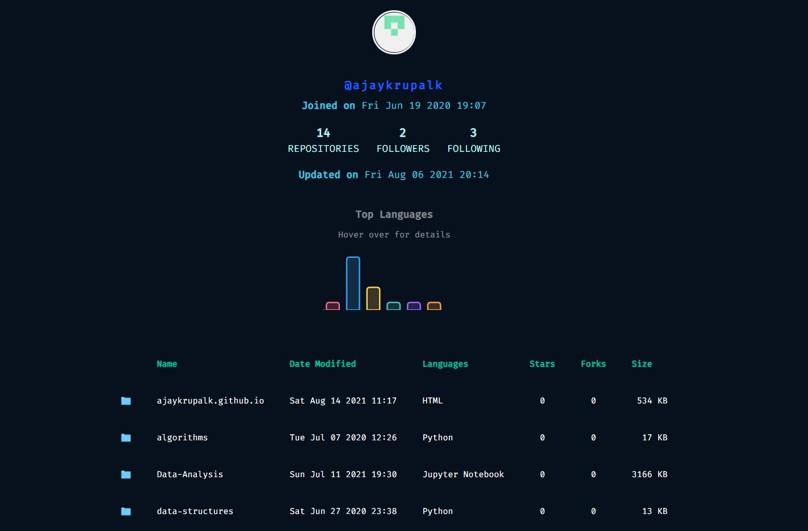

# OctoLab - A developer's approach to GitHub API

[OctoLab](https://ajaykrupalk.github.io/octolab/) Designed and Developed by Ajay Krupal K. <br>

Huge shoutout to **@iamshaunjp** for the [Async JavaScript Tutorial](https://youtube.com/playlist?list=PL4cUxeGkcC9jx2TTZk3IGWKSbtugYdrlu) on YouTube. <br>

Special thanks to **@nikhilkutinha** for all the inputs and suggestions. <br>

 <br>

## Introduction 

GitHub API can be accessed at:
> https://api.github.com/users

There are two approaches we can use to accessing the GitHub API using JavaScript:
- Using XMLHttpRequest()
- Using Fetch API

####  Using XMLHttpRequest()

> Create a request object

``` 
const request = new XMLHttpRequest(); 
```

>  XMLHttpRequest is used to receive data of any type

>  We make a request to the API using the API's endpoint
```
request.open('GET,`https://api.github.com/users`);
```
> Make sure to mention the endpoint [https://api.github.com/users] within backticks

> We then send the request to the API
```
request.send();
```

> With the above code, we can't find out the status of our request

> Therefore, we add an event listener
```
request.addEventListener('readystatechange',() => {
  if(request.readyState === 4){ 
    //if the operation of sending and receiving the data is complete, the readyState = 4
    console.log(request.responseText);
  }
})
```
> There are [five types](https://developer.mozilla.org/en-US/docs/Web/API/XMLHttpRequest/readyState) of readyState
